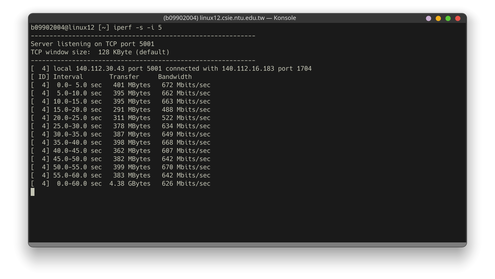
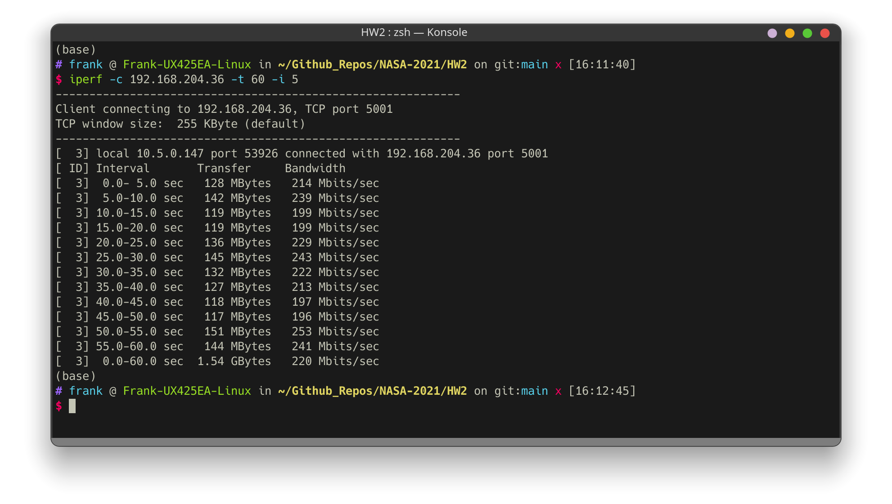
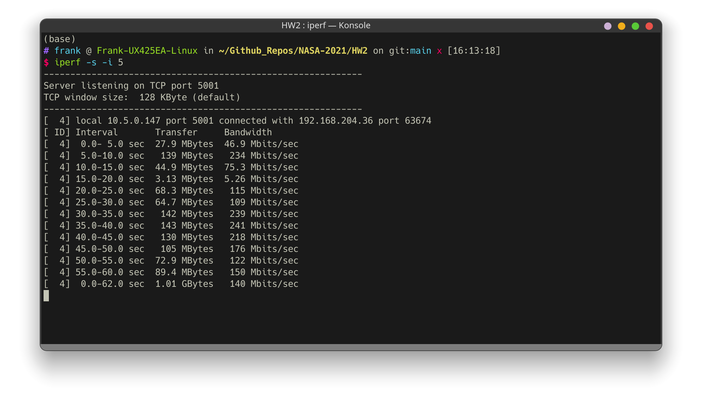
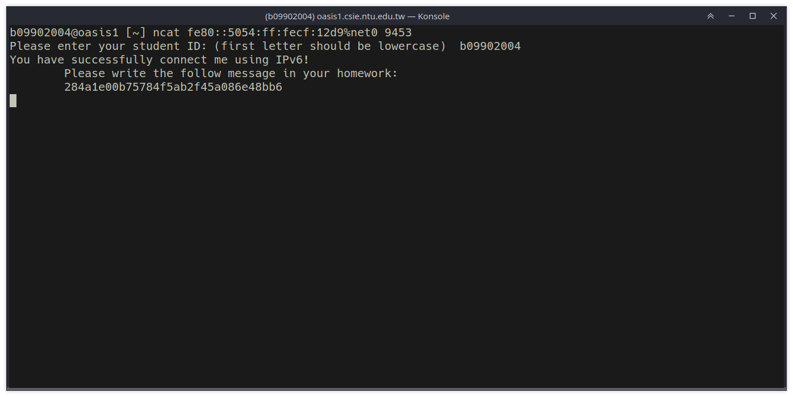

# NASA HW2

b09902004 郭懷元

## Network Administration

### 1. Short Answer

#### 1.

> Reference:
>
> http://www.cs.nthu.edu.tw/~nfhuang/chap04.htm
>
> https://zh.wikipedia.org/wiki/%E8%BD%BD%E6%B3%A2%E4%BE%A6%E5%90%AC%E5%A4%9A%E8%B7%AF%E8%AE%BF%E9%97%AE
>
> https://www.geeksforgeeks.org/collision-avoidance-in-wireless-networks/

CSMA/CD passively detects if a collision has happened. If it detects a collision, it will stop sending frames as soon as possible. CSMA/CA, on the other hand, will check if the medium is busy or not before sending anything. If it's busy, it will wait for a random time then continue the transmission. CSMA/CA also uses a three-way handshake called RTS/CTS.

In wireless network, it's really difficult to precisely detect a collision, because the two nodes that collides might not be within each other's range (a.k.a. hidden node). Therefore CSMA/CD won't work in   a wireless condition, but CSMA/CA's RTS/CTS can fix this problem.

### 2.

Collision domain is the range where transmission collisions happen. Boardcast domain is the range where all nodes can broadcast messages to each other.	

---

### 2. IPerf

#### 1.

**From R204 PC to CSIE Workstation**

On R204 PC

```shell
nslookup linux12.csie.ntu.edu.tw # to get the IP address of workstation
iperf -c 140.112.30.43
```

On CSIE Workstation

```shell
iperf -s -i 5
```

Result



**From laptop (connected to `csie-5G`) to R204 PC**

On R204 PC

```shell
ifconfig # to get the IP address of this system
iperf -s
```

On my laptop

```shell
iperf -c 192.168.204.36 -t 60 -i 5
```

Result



**From R204 PC to laptop  (connected to `csie-5G`)**

On my laptop

```shell
ifconfig # to get the IP address of this system
iperf -s -i 5
```

On R204 PC

```shell
iperf -c 10.5.0.147 -t 60
```

Result



**From laptop A to laptop B (both connected to `csie-5G`)**

On laptop A

```shell
ifconfig # to get the IP address of this system
iperf -s
```

On laptop B

```shell
iperf -c 10.5.6.200 -t 60 -i 5
```

Result


#### 2.

| From                              | To                                | Bandwidth Measured |
| --------------------------------- | --------------------------------- | ------------------ |
| R204 PC                           | CSIE Workstation                  | 626 Mbps           |
| Laptop (connected to `csie-5G`)   | R204 PC                           | 220 Mbps           |
| R204 PC                           | Laptop (connected to `csie-5G`)   | 140 Mbps           |
| Laptop A (connected to `csie-5G`) | Laptop B (connected to `csie-5G`) | 66.6 Mbps          |

The highest bandwidth is betweem R204 PC and CSIE Workstation, and it's because the path is completely on wire. In the data we can see that when WiFi is introduced in the path, the bandwidth is greatly reduced. The difference between laptop to PC and PC to laptop is probably because more downstream bandwidth of `csie-5G` is occupied than upstream bandwidth, and the bottle

---

 ### 3. IPv6

> Reference:
>
> https://unix.stackexchange.com/questions/457670/netcat-how-to-listen-on-a-tcp-port-using-ipv6-address
>
> https://ithelp.ithome.com.tw/articles/10244029
>
> https://stackoverflow.com/questions/24780404/python-tcp-socket-with-ipv6-address-failed

Commands:

```shell
ifconfig
ncat fe80::5054:ff:fecf:12d9%net0 9453
```

Server message:

```
284a1e00b75784f5ab2f45a086e48bb6
```




---

## System Administration

### 1.

> Reference:
>
> Lab 3 slides
>
> https://zh.wikipedia.org/wiki/%E6%96%87%E4%BB%B6%E7%B3%BB%E7%BB%9F
>
> http://linux.vbird.org/linux_basic/0230filesystem.php
>
> https://askubuntu.com/questions/24027/how-can-i-resize-an-ext-root-partition-at-runtime
>
> https://unix.stackexchange.com/questions/61209/create-and-format-exfat-partition-from-linux

Commands:

```shell
sudo -i
lsblk # check current status
parted /dev/sda print # check if it's MBR or GPT
pacman -Syy
pacman -S gdisk # install gdisk bc it's GPT
umount /dev/sda3
e2fsck /dev/sda3
resize2fs /dev/sda3 5G
gdisk /dev/sda
# then follow the instructions in gdisk to:
# 1. delete partition3
# 2. create partition 3 with 5 GB
# 3. create partition 4 with rest of the space
partprobe
vim /etc/fstab
# in vim:
# find the line for mounting /home/nasa/documents
# change the original 'UUID=<some ID>' to '/dev/sda3'
reboot
# after reboot
sudo -i
lsblk
mkfs.exfat /dev/sda4
mount /dev/sda4 /home/nasa/share
vim /etc/fstab
# in vim:
# add a new line like this:
# /dev/sda4    /home/nasa/share    exfat    defaults    0 0
reboot
lsblk; df -hT
```


---

### 2.

> Reference:
>
> https://www.cyberciti.biz/faq/linux-add-a-swap-file-howto/

Commands:

```shell
sudo -i
dd if=/dev/zero of=/myswap bs=1024 count=2097152
chown root:root /myswap
chmod 0600 /myswap
mkswap /swapfile1
swapon /myswap
free -h
```


---

### 3.

> References:
>
> https://linuxhint.com/set-up-btrfs-raid/

Commands:

```shell
sudo mkfs.btrfs -L p3 -d raid1 -m raid1 -f /dev/sdb /dev/sdc
sudo mount /dev/sdb /home/nasa/mnt
#sudo blkid --match-token TYPE=btrfs # look for the RAID array's UUID
#sudo vim /etc/fstab
cd ~
ls -lah
sudo chown nasa:nasa ~/mnt
sudo btrfs filesystem show /home/nasa/mnt; sudo btrfs filesystem df /home/nasa/mnt
```


---

### 4.

> References:
>
> https://linuxhint.com/create-mount-btrfs-subvolumes/

Commands:

```shell
sudo mount /dev/sdb /home/nasa/mnt
sudo btrfs subvolume create /home/nasa/mnt/@
sudo btrfs subvolume create /home/nasa/mnt/@videos
sudo btrfs subvolume create /home/nasa/mnt/@documents
sudo mount /dev/sdb -o subvol=@ /home/nasa/courses
sudo mount /dev/sdb -o subvol=@videos /home/nasa/courses/videos
sudo mount /dev/sdb -o subvol=@documents /home/nasa/courses/documents
sudo blkid --match-token TYPE=btrfs # look for the UUID of /dev/sdb
sudo vim /etc/fstab
sudo reboot
```


---

### 5.

> References:
>
> https://linuxhint.com/use-btrfs-snapshots/

Commands:

```shell
sudo btrfs subvolume snapshot -r /home/nasa/courses/documents /home/nasa/courses/documents_backup
```

---

### 6.

> References:
>
> https://linuxhint.com/back_up_btrfs_snapshots_external_drives/

Commands:

```shell
sudo cp -R /home/nasa/videos/* /home/nasa/courses/videos
sudo btrfs subvolume snapshot -r /home/nasa/courses/videos /home/nasa/courses/videos_backup
sudo btrfs send /home/nasa/courses/videos_backup | sudo btrfs receive /home/nasa/backup
```


---

### 7.

> References:
>
> https://btrfs.wiki.kernel.org/index.php/Using_Btrfs_with_Multiple_Devices
>
> https://superuser.com/questions/901067/btrfs-convert-from-raid1-to-raid5

Commands

```shell
sudo btrfs device add /dev/sdd /home/nasa/courses
sudo btrfs balance start -dconvert=raid5 -mconvert=raid5 /home/nasa/courses
```


---

### 8.

> References:
>
> https://btrfs.wiki.kernel.org/index.php/Using_Btrfs_with_Multiple_Devices

Commands

```shell
sudo btrfs device delete /dev/sdc /home/nasa/courses
sudo btrfs balance start -dconvert=raid1 -mconvert=raid1 /home/nasa/courses
```


