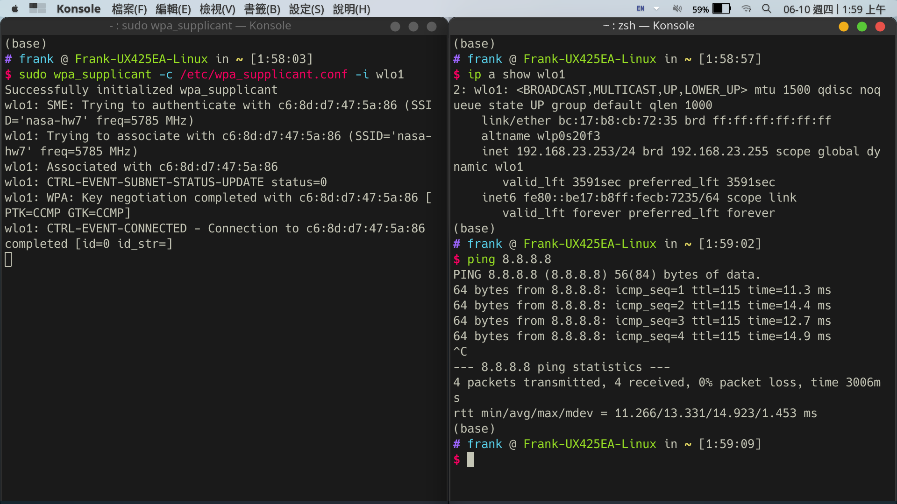

# NASA HW7

b09902004 郭懷元

## 1. SSID/BSSID

> Refs:
>
> https://note-on-clouds.blogspot.com/2018/11/wifi-bss-ess-ssid-essid-bssid.html
> https://en.wikipedia.org/wiki/Service_set_(802.11_network)

### 1.

*SSID* is the identifier of a group of devices (an AP and multiple user devices) connected via WiFi (a.k.a. service set). It's usually the "WiFi name" that users see.
*BSSID* is the identifier of different APs under the same service set. It's usually the MAC address of that AP.

### 2.

**(a)**
Yes. Virtual access point (VAP) allows one physical AP device to serve multiple SSID.

**(b)**
Yes. When using VAP, it also sets a unique BSSID for each SSID.

---

## 2. PSK/EAP/PEAP

> Refs:
>
> https://en.wikipedia.org/wiki/Wi-Fi_Protected_Access
> https://en.wikipedia.org/wiki/Extensible_Authentication_Protocol
> https://www.intel.com.tw/content/www/tw/zh/support/articles/000006999/wireless/legacy-intel-wireless-products.html
> https://en.wikipedia.org/wiki/Protected_Extensible_Authentication_Protocol

### 1.

In the context of WiFi security, *PSK* means the AP and the user device use a pre-shared key to encrypt and decrypt data.
*EAP* is a protocol that allows various supported authentication method to transfer needed parameters. *PSK* is one of the many *EAP* methods (*EAP-PSK*). *EAP* defines message formats, but not how the data should arrive at the other party.
*PEAP* is a protocol that encapsulate *EAP* data and send them over a TLS tunnel. *PEAP* sometimes also refers to a particular version of *PEAP* that use *EAP-MSCHAPv2* (should be what `ntu-peap` uses).

### 2.

*WPA-PSK* is more suitable for personal networks because it doesn't require a authentication server, which *WPA-802.1X* needs. It's also less secure than *802.1x*, which is okay in personal networks but not ideal for enterprise solutions.

---

## 3. WiFi Certificate


---

## 6. Connect to WiFi with terminal

> Refs:
>
> https://www.linuxbabe.com/ubuntu/connect-to-wi-fi-from-terminal-on-ubuntu-18-04-19-04-with-wpa-supplicant

SSID: `nasa-hw7` Password: `nasa2021`

Stop `NetworkManager` daemon, as it might cause some issue.

```shell
sudo systemctl stop NetworkManager
```

Check which interface is the wireless one.

```shell
iwconfig
```

In my case, it's `wlo1`.
Bring up the interface `wlo1`.

```shell
sudo ifconfig wlo1 up
```

Scan nearby networks and check if `nasa-hw7` can be found.

```shell
sudo iwlist wlo1 scan
```

Create config file for `wpa_supplicant`.

```shell
wpa_passphrase nasa-hw7 nasa2021 | sudo tee /etc/wpa_supplicant.conf
```

Connect!

```shell
sudo wpa_supplicant -c /etc/wpa_supplicant.conf -i wlo1
```

Open another terminal window, obtain IP address from DHCP server.

```shell
sudo dhclient wlo1
```

Everything should work now!



---

# System Administration

