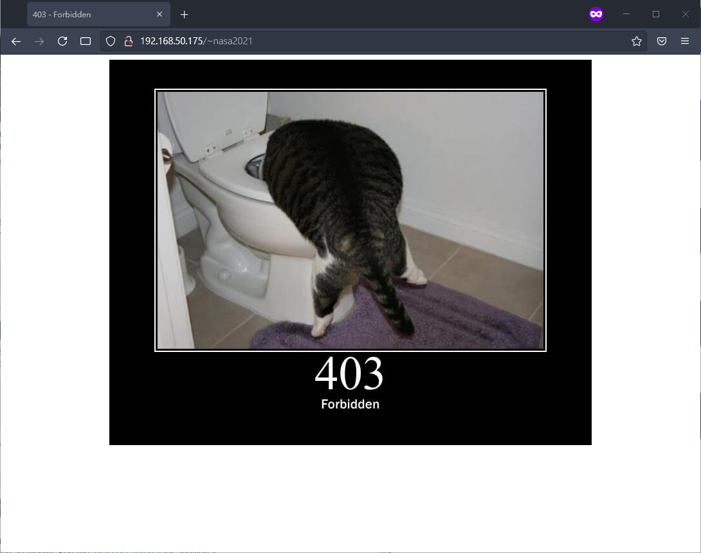

# NASA HW7

b09902004 郭懷元

## 1. SSID/BSSID

> Refs:
> 
> https://note-on-clouds.blogspot.com/2018/11/wifi-bss-ess-ssid-essid-bssid.html
> https://en.wikipedia.org/wiki/Service_set_(802.11_network)

### 1.

*SSID* is the identifier of a group of devices (an AP and multiple user devices) connected via WiFi (a.k.a. service set). It's usually the "WiFi name" that users see.
*BSSID* is the identifier of different APs under the same service set. It's usually the MAC address of that AP.

### 2.

**(a)**
Yes. Virtual access point (VAP) allows one physical AP device to serve multiple SSID.

**(b)**
Yes. When using VAP, it also sets a unique BSSID for each SSID.

---

## 2. PSK/EAP/PEAP

> Refs:
> 
> https://en.wikipedia.org/wiki/Wi-Fi_Protected_Access
> https://en.wikipedia.org/wiki/Extensible_Authentication_Protocol
> https://www.intel.com.tw/content/www/tw/zh/support/articles/000006999/wireless/legacy-intel-wireless-products.html
> https://en.wikipedia.org/wiki/Protected_Extensible_Authentication_Protocol

### 1.

In the context of WiFi security, *PSK* means the AP and the user device use a pre-shared key to encrypt and decrypt data.
*EAP* is a protocol that allows various supported authentication method to transfer needed parameters. *PSK* is one of the many *EAP* methods (*EAP-PSK*). *EAP* defines message formats, but not how the data should arrive at the other party.
*PEAP* is a protocol that encapsulate *EAP* data and send them over a TLS tunnel. *PEAP* sometimes also refers to a particular version of *PEAP* that use *EAP-MSCHAPv2* (should be what `ntu-peap` uses).

### 2.

*WPA-PSK* is more suitable for personal networks because it doesn't require a authentication server, which *WPA-802.1X* needs. It's also less secure than *802.1x*, which is okay in personal networks but not ideal for enterprise solutions.

---

## 3. WiFi Certificate

> Refs:
> 
> https://security.stackexchange.com/questions/102550/what-are-wifi-certificates-used-for-what-are-they
> https://en.wikipedia.org/wiki/Extensible_Authentication_Protocol#EAP_Transport_Layer_Security_(EAP-TLS)
> https://en.wikipedia.org/wiki/Public_key_certificate

### 1.

A certificate includes a public key, information about who has this public key, and a digital signature signed by CA to verify it. To prevent users from connecting to rogue APs, a WiFi AP will send its certificate to prove its identity, then users can check if this certificate can be trusted by the digital signature signed by CA.

### 2.

Certificate authorities are trusted third party organizations that issue verified certificates. The issued certificates comes with a digital signature signed by the CA issued it.

---

## 4. csie/csie-5G

> Refs:
> 
> https://kb.netgear.com/29396/What-is-the-difference-between-2-4-GHz-and-5-GHz-wireless-frequencies
> https://www.cisco.com/en/US/docs/solutions/Enterprise/Mobility/emob41dg/ch3_WLAN.pdf

### 1.

|                                          | 2.4 GHz | 5 GHz   |
| ---------------------------------------- | ------- | ------- |
| Range                                    | Longer  | Shorter |
| Data Rate                                | Lower   | Higher  |
| Channels                                 | Less    | More    |
| Interference<br />From Other Electronics | More    | Less    |
| Wall penetration                         | Better  | Worse   |

### 2.

For regular web browsing and school work, 2.4 GHz provides ok-ish data rate and a wider signal coverage, therefore should be using `csie`.

For downloading large files and watching lecture streams, 5 GHz provides higher data rate and more stable connection if at a proper spot, therefore should be using `csie-5G`.

---

## 5. AP location

> Refs:
> 
> https://arstechnica.com/gadgets/2020/02/the-ars-technica-semi-scientific-guide-to-wi-fi-access-point-placement/


The extra AP should be placed at the red circle in the picture above.

Assuming that APs are mounted on the ceiling, most devices are at the seats, and device connects to the AP with strongest received signal. We need a position that:

1. Reduce the distance from furthest devices to AP
2. Balance the number of connected device of each AP

In the case of R103 classroom, the second requirement is more important because the current distance isn't too long and there are few obstacles. Therefore the red spot is chosen, as it divide the room more equally.


---

## 6. Connect to WiFi with terminal

> Refs:
> 
> https://www.linuxbabe.com/ubuntu/connect-to-wi-fi-from-terminal-on-ubuntu-18-04-19-04-with-wpa-supplicant

SSID: `nasa-hw7` Password: `nasa2021`

Stop `NetworkManager` daemon, as it might cause some issue.

```shell
sudo systemctl stop NetworkManager
```

Check which interface is the wireless one.

```shell
iwconfig
```

In my case, it's `wlo1`.
Bring up the interface `wlo1`.

```shell
sudo ifconfig wlo1 up
```

Scan nearby networks and check if `nasa-hw7` can be found.

```shell
sudo iwlist wlo1 scan
```

Create config file for `wpa_supplicant`.

```shell
wpa_passphrase nasa-hw7 nasa2021 | sudo tee /etc/wpa_supplicant.conf
```

Connect!

```shell
sudo wpa_supplicant -c /etc/wpa_supplicant.conf -i wlo1
```

Open another terminal window, obtain IP address from DHCP server.

```shell
sudo dhclient wlo1
```

Everything should work now!


---

# System Administration

## 1. 防疫新server

### 0. Setup VM

> Refs:
> 
> https://autumncher.pixnet.net/blog/post/445613684-%E3%80%90linux%E3%80%91centos-7-%E5%A6%82%E4%BD%95%E8%A8%AD%E5%AE%9A%E7%B6%B2%E8%B7%AF-(how-to-setup-network

Edit `/etc/sysconfig/network-scripts/ifcfg-ens33`

```
...
ONBOOT=yes
```

Restart the interface:

```shell
sudo ifdown ifcfg-ens33 && sudo ifup ifcfg-ens33
```

Install Apache server

```shell
sudo yum install -y httpd
sudo systemctl start httpd
sudo systemctl enable httpd
```

### 1.

> Refs:
> 
> Lab Slide
> https://httpd.apache.org/docs/2.4/custom-error.html

#### (a)

```shell
sudo firewall-cmd --add-service=http --permanent
sudo firewall-cmd --reload
```

#### (b)

Unzip `pages.zip` under home directory.

```shell
unzip pages.zip
```

Copy `index.html` to `/var/www/html`. Note that we need root permission to write in `/var/www/html`.

```shell
sudo cp ~/index.html /var/www/html
```


#### (c)

Copy `404.html` to `/var/www/html`

```shell
sudo cp ~/404.html /var/www/html
```

Add a line to `/etc/httpd/conf/httpd.conf` (with root permission)

```
ErrorDocument 404 /404.html
```

Note that file path `/404.html` is relative to `DocumentRoot`, which is `/var/www/html` by default.

Reload `httpd`

```shell
sudo systemctl reload httpd
```


#### (d)

Copy `403.html` to `/var/www/html`

```shell
sudo cp ~/403.html /var/www/html
```

Add a line to `/etc/httpd/conf/httpd.conf` (with root permission)

```
ErrorDocument 403 /403.html
```

Reload `httpd`

```shell
sudo systemctl reload httpd
```

---

### 2.

> Refs:
> 
> https://httpd.apache.org/docs/2.4/logs.html
> http://n.sfs.tw/content/index/10147
> https://linuxize.com/post/how-to-create-symbolic-links-in-linux-using-the-ln-command/

Edit this line in `/etc/httpd/conf/httpd.conf`

```
from:
CustomLog "logs/access_log" combined
to:
CustomLog "logs/tracking.log" combined
```

Create the directory `/var/log/apache`

```shell
sudo mkdir /var/log/apache
```

Recreate the link at `/etc/httpd/logs`

```shell
sudo rm /etc/httpd/logs
sudo ln -s /var/log/apache /etc/httpd/logs
```

---

## 2. 小夥伴們的個人頁面

### 1.

> Refs:
> 
> https://www.tecmint.com/enable-apache-userdir-module-on-rhel-centos-fedora/
> https://askubuntu.com/a/720162
> https://www.if-not-true-then-false.com/2010/enable-apache-userdir-with-selinux-on-fedora-centos-red-hat-rhel/

#### (a)

Include `userdir` module by adding a line in `/etc/httpd/conf/httpd.conf`

```
Include conf.d/userdir.conf
```

In `/etc/httpd/conf.d/userdir.conf`, replace the line originally in `<IFModule>` with these two

```
UserDir enabled
UserDir public_html
```

Change permission of all home directories

```shell
sudo chmod 755 /home/*
```

Configure SELinux

```shell
sudo setsebool -P httpd_enable_homedirs true
```

Reload `httpd`

```shell
sudo systemctl reload httpd
```


#### (b)

Change the permission to our home directory

```shell
chmod 700 ~
```



---

### 2.

> Refs:
> 
> Lab Slide

Install `php` and reload `httpd`

```shell
sudo yum install -y php php-mysql
sudo yum install -y http://rpms.remirepo.net/enterprise/remi-release-7.rpm
sudo yum-config-manager --enable remi-php74
sudo yum install -y php
sudo systemctl reload httpd
```

Include `php` module by adding this line in `/etc/httpd/conf/httpd.conf`

```
Include conf.d/php.conf
```

Then reload

```shell
sudo systemctl reload httpd
```

The request to `http://[vm_ip]/~student087/goodbye.php` gets the output of the php script.


---

## 3. Reverse Proxy

> Refs:
> 
> https://richarlin.tw/blog/apache_reverse_proxy/
> https://blog.gtwang.org/web-development/apache-proxy/
> http://httpd.apache.org/docs/2.2/mod/mod_proxy.html

Add these lines to `httpd.conf`

```
LoadModule proxy_module modules/mod_proxy.so
LoadModule proxy_http_module modules/mod_proxy_http.so

ProxyRequests Off

ProxyPass /green http://10.217.44.30
ProxyPassReverse /green http://10.217.44.30

ProxyPass /blue http://10.217.44.60
ProxyPassReverse /green http://10.217.44.60
```

The first two lines load module `mod_proxy` and `mod_proxy_http`.

Turn off forward proxy since leaving it on would cause some security concerns.

And the last four lines will convert `140.112.30.256/green` and `140.112.30.256/blue` to the IP address of the  corresponding server vm.
